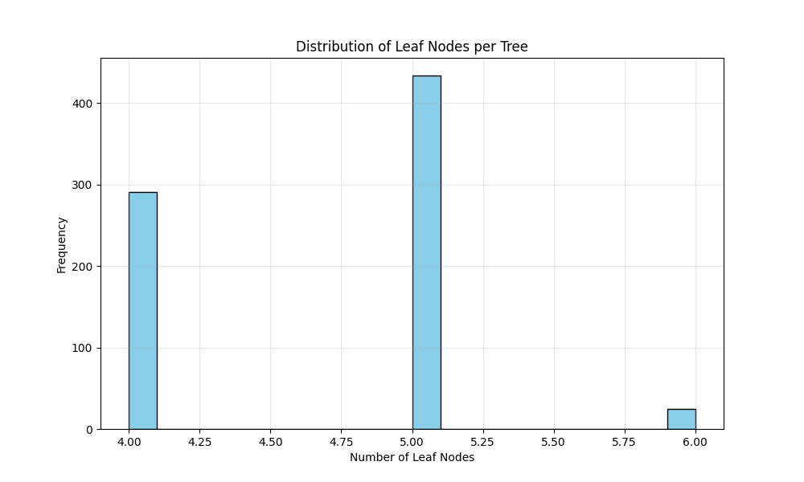
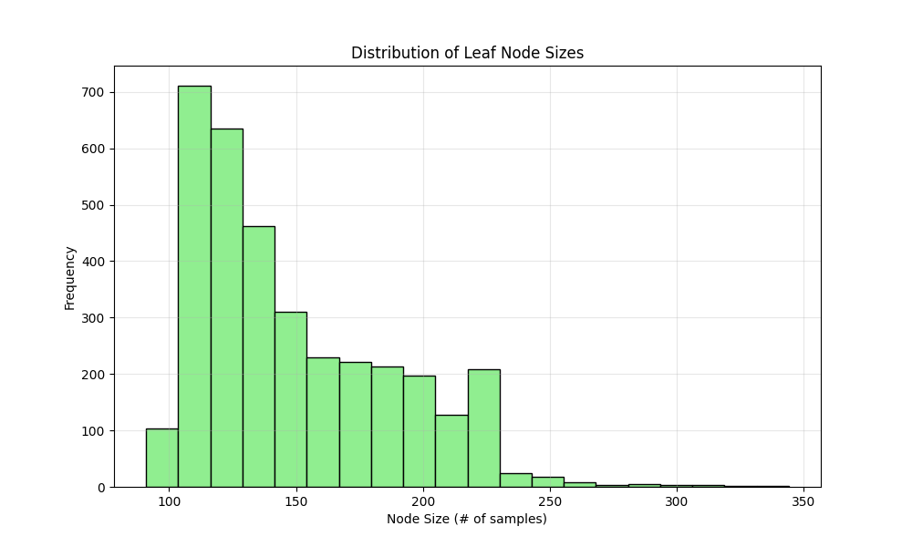
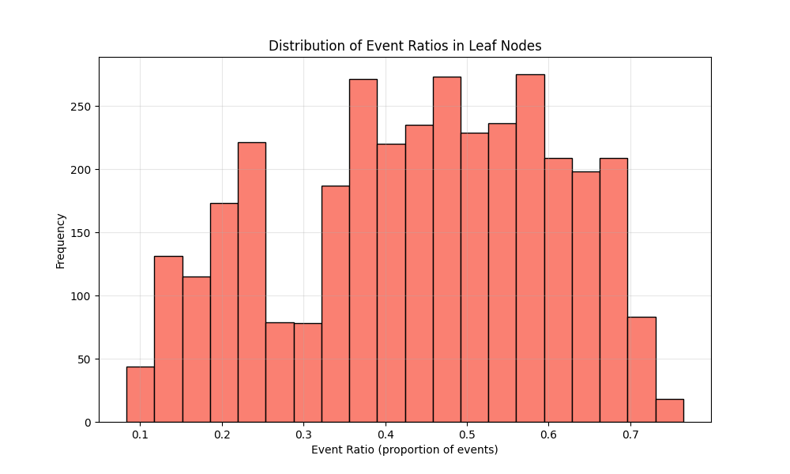

# RSF Model Specification:
Model file: rsf/rsf_results_affy/20250616_rsf_model-750-trees-maxdepth-3-675-features.pkl
Number of covariates: 675
Number of trees: 750
Max depth: 3
min_samples_leaf: 70
max_features: 0.5
min_weight_fraction_leaf: 0.0
Bootstrap: True
min_samples_split: 6
max_leaf_nodes: None
oob_score: False
warm_start: False
max_samples: None
Random state: 42
# Performance Metrics:
Training C-index: 0.7970
Validation C-index: 0.7119
Test C-index: 0.6628
Covariates 
- Stage_IA
- Age
- GUCY1A1
- ZNF507
- CSNK1E
- AGTR2
- NDUFA10
- PFKP
- GPC3
- ETV5
- STAT5A
- FAM117A
- PWWP3A
- MBD1
- ADTRP
- Stage_IB
- OLFM4
- BEGAIN
- ALDH9A1
- UGT2B17
- ULK4
- LDHC
- RELN
- APAF1
- MYG1
- EXOC1
- SOX2
- KCNJ16
- SCNN1G
- SQSTM1
- KLK6
- GSTA2
- AVPR1A
- FCGR3B
- CEP97
- PSTPIP2
- OSBPL1A
- FBXO9
- TENT5C
- ZPBP
- MCTP1
- WT1
- LRRN3
- ASAP1
- TRIM9
- PPP1R3D
- ZNF274
- RFXAP
- STIM1
- PKNOX2
- ANKRD7
- FPR2
- IL15
- TXLNGY
- SCN11A
- C1QB
- CBX4
- PCDHB6
- NSUN3
- DHX35
- CD79A
- VILL
- ASPA
- P2RX5
- PRSS8
- C9orf40
- SLC16A3
- LPP
- COL8A2
- KIF17
- GAS7
- HIP1
- MAP2K3
- NDRG1
- SLCO2B1
- BUB1
- UBE2K
- LAD1
- CCDC186
- AKAP3
- SNHG14
- CTAG1B
- FAM13C
- SLC6A11
- ADAM22
- SIM1
- AKR1D1
- TMEM248
- TMEM185B
- TUBAL3
- IFT140
- CTSZ
- LSM14B
- SURF1
- KLHL36
- ADD3-AS1
- SNX10
- CPT1A
- SSPN
- CCDC30
- CCDC121
- CREG1
- CPB1
- DLAT
- MFAP2
- SMYD3
- RABL6
- ADCYAP1
- SLC8A1
- SPART
- FOXO3B
- EPHB4
- CTNND1
- LDLRAP1
- NEMF
- XPNPEP1
- EXT1
- SLC2A5
- DIO2
- GALT
- CEP192
- SULF1
- VPS9D1
- MSC
- RAI2
- L2HGDH
- KLK2
- TYRP1
- GNLY
- EP300
- ZNF862
- FOSL2
- NPR3
- DSTNP2
- PLAAT1
- ADGRL1
- FRMD1
- TRHDE
- ATP6V0A1
- NDUFA5
- MPC2
- TH
- RPS4X
- ZNF205-AS1
- LAIR1
- MS4A4A
- ACOT8
- LGSN
- TAS2R10
- MRPS18B
- TBC1D5
- SMPD3
- LILRB2
- MAP1LC3C
- CERS4
- LRRC31
- OAZ2
- LGALS4
- FADS3
- TWIST1
- MAGEA2
- AOC4P
- UBR7
- SLC43A3
- Stage_II
- PGA5
- GCH1
- ST18
- ZNF518A
- KLHL2
- YBX1
- INVS
- TMEM62
- TSPAN8
- MGAT2
- MMP8
- ACOT11
- COL2A1
- ECHDC1
- MYO3A
- TMSB10
- FCGR1A
- NCOA6
- USP19
- IRF8
- PRPSAP2
- RAP2B
- STXBP1
- MARF1
- DRD3
- PCBD1
- KLK10
- XRCC1
- CARD9
- PML
- FIP1L1
- PIAS4
- SLC1A2
- PSME4
- BASP1
- LPAR4
- UGT2A3
- CCR3
- SYNGR4
- CD6
- SNORA21
- AGO3
- B9D1
- PARP16
- WFS1
- KIR2DL4
- ETV4
- PLGRKT
- ZCCHC24
- PLTP
- GLTP
- ACTR1A
- WAC
- SEPTIN9
- DAAM1
- RACK1
- BCL6
- TRAF3IP1
- SIGLEC1
- ANO10
- MRPL20
- CDK4
- OR3A1
- BAG1
- HSF2BP
- RC3H1
- HAUS2
- NEBL
- MIR124-1HG
- THYN1
- LTBP3
- PAK1
- P4HA2
- ARHGAP44
- GPR25
- DMXL2
- AKAP17A
- GPR22
- ELF1
- KHSRP
- FAXDC2
- CEP131
- LAPTM5
- KXD1
- KCNF1
- ATP5F1D
- MRTFB
- FPGS
- SLC38A6
- PFKFB4
- TBC1D2B
- TRAF3IP2
- NPY4R
- GREB1
- GTDC1
- FHIT
- CD300A
- B3GALT4
- LRP1B
- VEGFA
- MIR22HG
- EZR
- BMPR1B
- ACSL4
- TPM3
- ELAVL3
- XRCC3
- ZNF135
- SLCO4A1
- OPTN
- RPL26L1
- ITGBL1
- TENT5A
- FOXN1
- PDCD1LG2
- ODC1
- STXBP2
- ATF6B
- FAAP100
- SAMD9
- ZFR2
- MLXIP
- SLF2
- SALL1
- GFER
- SLC12A4
- ZC3H15
- FZD8
- H4C4
- RSRC2
- NUAK2
- OR7E24
- HUNK
- GAPDH
- PDCD1
- URM1
- NOS2
- RNASEH1
- MTARC2
- TDRD3
- SLC27A5
- SLC11A2
- SATB2
- NDUFAF3
- CSF2RA
- POLL
- LTBP1
- SLC35C2
- CTBP2
- TMEM147-AS1
- SEC14L3
- MYO1D
- RPL32
- ZNF654
- FKTN
- NEIL3
- CSPG4
- ZBTB22
- PRR5L
- LRRFIP1
- GPR162
- CALML3
- DCAF8
- GLUL
- SUV39H2
- PDE6H
- GRAMD1B
- DBNDD1
- UQCRQ
- PLEKHA6
- CTSL
- DNAJA1
- PUM1
- TRIO
- TTYH1
- EDNRB
- CGRRF1
- MYCT1
- POLR2J4
- PSME3IP1
- VGF
- DCLRE1B
- TRAPPC3
- HOXB5
- CDH2
- TLL2
- S1PR2
- ZNF835
- SYNC
- PPP1R3C
- HSPA5
- PIK3R1
- C1orf115
- SEPTIN10
- ZBTB39
- HHIPL2
- SNX19
- CCR6
- ADGRF5
- SRGN
- KIFC3
- PDLIM3
- SEMG2
- ZNF302
- TCP11L1
- SCN7A
- INPP5A
- ADH1C
- SIGLEC9
- SLC35E3
- SLC30A9
- TMEM187
- KIR3DS1
- DOK4
- GSTA4
- HTR2A
- PGLS
- FOXN3
- PANX1
- KIF3A
- DCXR
- CRELD2
- SNX2
- HGSNAT
- CDKN1A
- CALCB
- FKBP4
- CTAGE9
- CHRDL1
- AGO4
- KCNJ15
- CCR10
- GLRA3
- HMBOX1
- ULK2
- STX5
- LDB3
- TMCC1
- DNAAF1
- UFL1
- PSG6
- TMEM92-AS1
- KNL1
- MRS2
- HNRNPA3
- RPL13
- ITGB5
- AGGF1
- NEDD4L
- WHRN
- JAK2
- FBXO22
- OSBPL8
- MME
- PDLIM2
- NCOA2
- PDE10A
- WSCD1
- EEF1G
- AIM2
- MYO1E
- LIMS1
- EIF4H
- PCNT
- ZCCHC4
- SLC31A2
- OTC
- SEC63
- EPB42
- TBC1D19
- SPAG16
- RFC5
- ALDH4A1
- LAMA4
- PLAA
- NFRKB
- URGCP
- KDSR
- FAF1
- SLC52A1
- SIGLEC6
- PTPRG
- CX3CL1
- ATP1B2
- NES
- S100A14
- DGKE
- ETV1
- ZC3H13
- ACSL1
- CCDC70
- ASB8
- GNG7
- PSMC6
- RBM15
- PDGFRA
- CCNC
- TDO2
- TP53TG1
- PDE11A
- NAP1L2
- DIAPH3
- LINC00312
- LEFTY1
- DEPTOR
- RHCE
- IFITM1
- LY96
- ICOS
- RETSAT
- NDN
- PACSIN2
- SMIM7
- CHST12
- CEP72
- SSRP1
- RUBCNL
- RRP8
- PCDHGA10
- REPIN1
- GTF2H2
- HNRNPH3
- TGFA
- GPR35
- TKT
- SETBP1
- PFDN4
- VPS16
- FCRL2
- ENO3
- SRSF4
- FABP6
- HSPA4L
- YIF1A
- DCUN1D2
- BNIP2
- BAIAP2L2
- PRPF39
- PTPRZ1
- PDZRN4
- GMFB
- KLRA1P
- MOB4
- GC
- CAVIN2
- ASIC3
- LMO7
- ZFAND1
- SYTL2
- CCNA1
- ABCA11P
- IP6K1
- ZNF280D
- NR3C2
- H2AC11
- TEX14
- CDH16
- GRB14
- PFKFB2
- SEC24B
- PLAC8
- HINFP
- MNT
- IL6ST
- CPNE3
- SLC26A6
- GAS6
- GPAA1
- FAM168A
- ZFP37
- NOCT
- MUC8
- ENTPD7
- KCNJ6
- SESN1
- GP1BA
- RAP1GDS1
- NPRL3
- CSTF3
- RAP1GAP2
- TUBGCP3
- CTSV
- LINC00667
- CRTAM
- GOLGA1
- BSG
- NAALAD2
- CAP2
- VAMP3
- PLPP2
- PLAG1
- BEX1
- OGT
- MCM3
- NOTCH3
- DAZAP2
- HOXA10
- PLIN2
- APBB1
- CDCP1
- ENDOG
- XYLT2
- POU5F1P4
- SRD5A3
- YWHAH
- SETD1B
- ZNF710-AS1
- CPN1
- RAB15
- KIF1C
- SIRT5
- ITGB4
- MEP1A
- PLOD2
- SCLY
- SLCO1B3
- PRPS2
- ZNF337
- HTR1E
- IL36RN
- CCDC181
- ARPP19
- CHRNG
- TTC31
- MFHAS1
- IL10
- TNFRSF11B
- TRGV7
- TMC7
- FST
- MAN2A2
- TRMT1
- COLGALT1
- GNA12
- STC2
- MYF5
- SSR4
- TSG101
- SLC50A1
- ASCC3
- GOT1
- TTC28
- MAEA
- TMEM63A
- RFX3
- DCLK1
- HDHD3
- CXCL14
- MS4A6A
- EGLN1
- CDKN1C
- CARD14
- TANK
- RBM34
- RPL28
- SLC16A1
- PPARD
- B2M
- TAF2
- RARS1
- AGTR1
- NIBAN1
- HPSE
- CYP4F12
- MATN3
- PSORS1C1
- ERP44
- COL6A3
- SLC1A3
- DPY19L2P2
- YARS2
- ADAM5
- R3HDM4
- FGFR4
- METAP2
- UBFD1
- AOX1
- MSRB1
- PALB2
- TMEM127
- NBL1
- GOLGA8N
- COPB1
- POU4F1
- HJURP
- PAFAH1B1
- ACAP1
- PPIEL
- CDC42BPA
- S100A11
- NYNRIN
- PSD
- SELP
- SEMA7A
- OGFRL1
- PPFIBP2
- EGLN2
- SLC9A1
- TCF4
- AVL9
- EIF2AK1
- IPCEF1
- ALDOA
- ADAMTSL2
- B3GALT2
- SEC62
- CCN6
- EFCC1
- TRNAU1AP
- ECE1

 ## A Walk through the Forest:

### Tree Structure Statistics:
- **Number of trees**: 750
- **Leaf nodes per tree**: 4.65 ± 0.54 (mean ± std)
- **Range of leaf nodes**: 4 to 6
- **Average leaf node size**: 148.75 ± 38.73 samples
- **Range of node sizes**: 91 to 344 samples
- **Event ratio in leaf nodes**: 0.4404 ± 0.1650

### Visualizations:

### Key Findings:
- The forest consists of 750 trees with an average of 4.6 leaf nodes per tree
- Most leaf nodes contain between 117.0 and 175.0 samples (interquartile range)
- The event ratio distribution shows moderate homogeneity across leaf nodes
- Some leaf nodes are heavily skewed toward events or censoring
    # Date: 20250616
# Time: 2025-06-16 09:09:07
