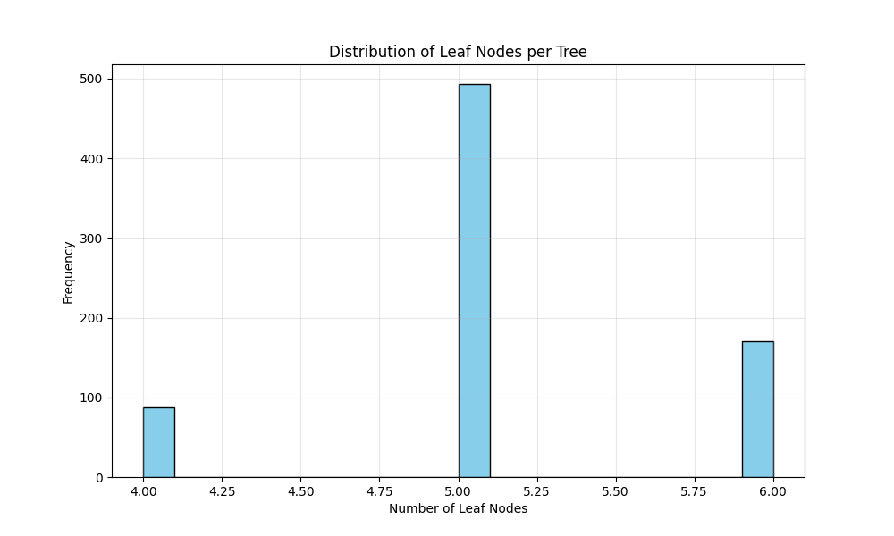
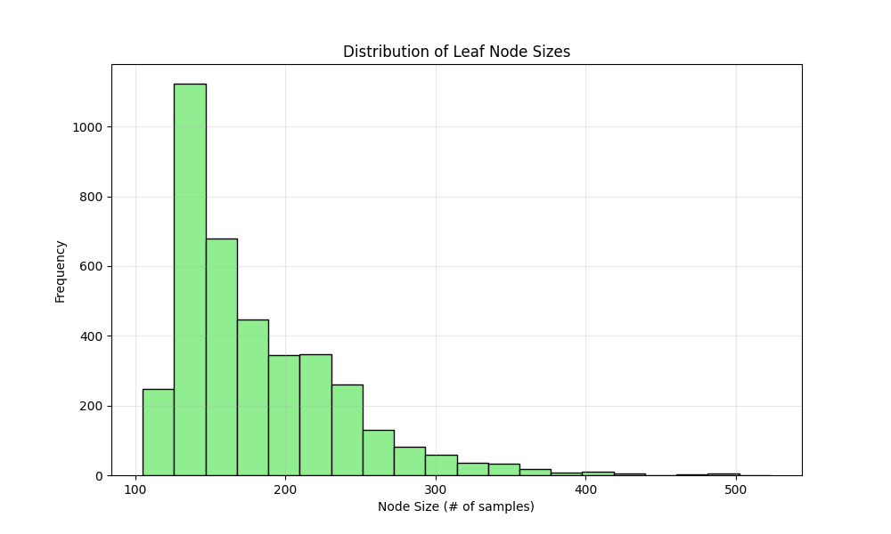
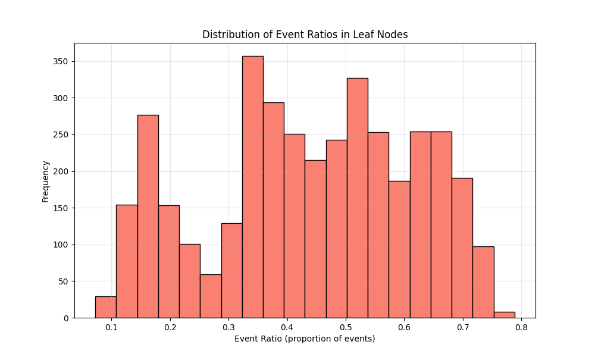

# RSF Model Specification:
Model file: rsf/rsf_results_affy/20250628_rsf_model-750-trees-maxdepth-3-75-features.pkl
Number of covariates: 75
Number of trees: 750
Max depth: 3
min_samples_leaf: 80
max_features: 0.5
min_weight_fraction_leaf: 0.0
Bootstrap: True
min_samples_split: 6
max_leaf_nodes: None
oob_score: False
warm_start: False
max_samples: None
Random state: 42
# Performance Metrics:
Training C-index (train + validation combined): 0.7656
Test C-index: 0.6677
Covariates 
- Stage_IA
- FAM117A
- CCNB1
- PURA
- PFKP
- PARM1
- ADGRF5
- GUCY1A1
- SLC1A4
- TENT5C
- Age
- HILPDA
- ETV5
- STIM1
- KDM5C
- NCAPG2
- ZFR2
- SETBP1
- RTCA
- AGTR2
- EGLN2
- PKM
- SQOR
- WT1
- PARVB
- UBE2Z
- TRIM37
- PLPPR1
- NDUFA10
- RGS20
- SETD3
- ECT2
- ARHGEF2
- TUBGCP3
- ANKRD34C
- YJU2B
- ABAT
- APAF1
- KLK6
- FLNA
- GRAMD1B
- CD79A
- OSBPL1A
- TRIM9
- SEC23A
- L2HGDH
- KLHL36
- NEMF
- CTNND1
- OXSR1
- ZC2HC1A
- TRIM68
- OLFM4
- KYNU
- UBE3C
- CLEC4E
- BCL2L13
- HLF
- DNAJC25-GNG10
- LDLRAP1
- IL6ST
- RFXAP
- PPFIBP2
- STIP1
- DDX51
- GTPBP4
- NMI
- ADAM22
- SLC2A1
- EXOC1
- BCAM
- GRIA4
- ARHGAP44
- PARP6
- FPGS

 ## A Walk through the Forest:

### Tree Structure Statistics:
- **Number of trees**: 750
- **Leaf nodes per tree**: 5.11 ± 0.57 (mean ± std)
- **Range of leaf nodes**: 4 to 6
- **Average leaf node size**: 180.41 ± 55.64 samples
- **Range of node sizes**: 105 to 523 samples
- **Event ratio in leaf nodes**: 0.4399 ± 0.1736

### Visualizations:

### Key Findings:
- The forest consists of 750 trees with an average of 5.1 leaf nodes per tree
- Most leaf nodes contain between 139.0 and 212.0 samples (interquartile range)
- The event ratio distribution shows moderate homogeneity across leaf nodes
- Some leaf nodes are heavily skewed toward events or censoring
    # Date: 20250628
# Time: 2025-06-28 12:17:54
