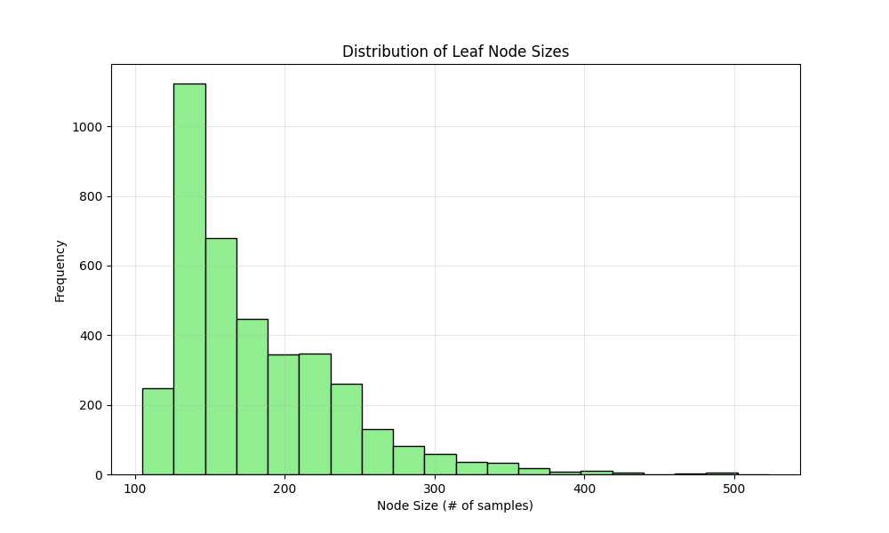
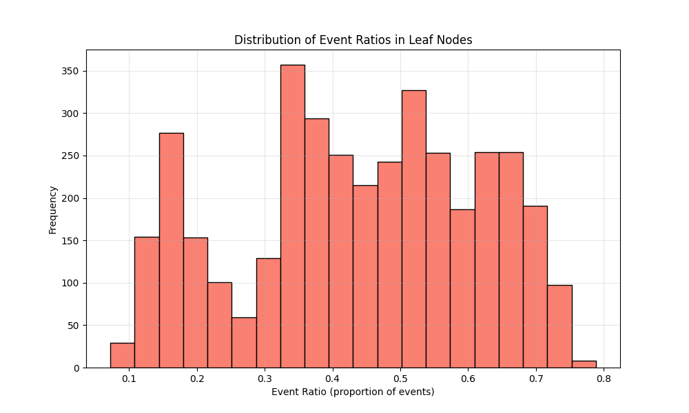

# RSF Model Specification:
Model file: rsf/rsf_results_affy/20250628_rsf_model-750-trees-maxdepth-5-300-features.pkl
Number of covariates: 300
Number of trees: 750
Max depth: 5
min_samples_leaf: 80
max_features: 0.5
min_weight_fraction_leaf: 0.0
Bootstrap: True
min_samples_split: 6
max_leaf_nodes: None
oob_score: False
warm_start: False
max_samples: None
Random state: 42
# Performance Metrics:
Training C-index (train + validation combined): 0.7790
Test C-index: 0.6654
Covariates 
- Stage_IA
- FAM117A
- CCNB1
- PURA
- PFKP
- PARM1
- ADGRF5
- GUCY1A1
- SLC1A4
- TENT5C
- Age
- HILPDA
- ETV5
- STIM1
- KDM5C
- NCAPG2
- ZFR2
- SETBP1
- RTCA
- AGTR2
- EGLN2
- PKM
- SQOR
- WT1
- PARVB
- UBE2Z
- TRIM37
- PLPPR1
- NDUFA10
- RGS20
- SETD3
- ECT2
- ARHGEF2
- TUBGCP3
- ANKRD34C
- YJU2B
- ABAT
- APAF1
- KLK6
- FLNA
- GRAMD1B
- CD79A
- OSBPL1A
- TRIM9
- SEC23A
- L2HGDH
- KLHL36
- NEMF
- CTNND1
- OXSR1
- ZC2HC1A
- TRIM68
- OLFM4
- KYNU
- UBE3C
- CLEC4E
- BCL2L13
- HLF
- DNAJC25-GNG10
- LDLRAP1
- IL6ST
- RFXAP
- PPFIBP2
- STIP1
- DDX51
- GTPBP4
- NMI
- ADAM22
- SLC2A1
- EXOC1
- BCAM
- GRIA4
- ARHGAP44
- PARP6
- FPGS
- PUM3
- ATP8B2
- SETD1B
- GTF3C3
- LTBP3
- NME2
- PMCHL1
- EGLN1
- ORC1
- COPG2IT1
- CHST2
- PIK3R1
- TNPO1
- IL7R
- PBK
- PLGRKT
- SH3GLB1
- MAN1C1
- LPAR4
- GPR22
- IREB2
- CHEK1
- RACK1
- Stage_IB
- ACACB
- DSP
- SCN7A
- CAPZA1
- NDRG1
- TNFRSF17
- YWHAH
- SNHG14
- PML
- DDX41
- CDH12
- ACOT11
- PIGR
- ABI2
- ZPBP
- TMEM184B
- WDR37
- RANBP6
- PIK3C2A
- GRM6
- KYAT3
- GPC3
- PSTPIP2
- ATP11B
- LHFPL2
- TH
- TPGS2
- ZC3H15
- DOK4
- MFHAS1
- NLGN4Y
- COL2A1
- LTBP2
- FCGR3B
- BCHE
- CDC42SE1
- SCNN1G
- KIF3A
- SYNC
- ZBTB39
- HJURP
- VPS51
- DIAPH3
- GMFB
- TMX2
- BRIP1
- TMSB10
- HGSNAT
- TNIP3
- DAZL
- CYREN
- ZPR1
- CHST15
- GLUL
- RECQL
- RASL12
- PTBP3
- KCNJ16
- ZNF280D
- TFRC
- SWAP70
- CCNA2
- ZNF44
- IBTK
- PTGER4
- OAS3
- SPINT1
- GBE1
- ATP13A3
- LPIN1
- TAF9
- UPF3B
- GLRA3
- TGFA
- DYNLT3
- IGLV4-60
- LILRA6
- CDYL
- SEMA4A
- NAP1L2
- APOL1
- PSMC6
- SHB
- BSG
- TNXA
- CREG1
- PLAC8
- DCN
- GLS2
- EEF1E1
- DMTF1
- ADAM10
- CENPE
- UBR7
- Stage_II
- SLC16A3
- LGALS4
- SLC25A24
- MYH10
- CTSV
- CDCP1
- NUP133
- SPG11

 ## A Walk through the Forest:

### Tree Structure Statistics:
- **Number of trees**: 750
- **Leaf nodes per tree**: 5.63 ± 0.53 (mean ± std)
- **Range of leaf nodes**: 4 to 7
- **Average leaf node size**: 163.82 ± 35.55 samples
- **Range of node sizes**: 104 to 283 samples
- **Event ratio in leaf nodes**: 0.4360 ± 0.1753

### Visualizations:

### Key Findings:
- The forest consists of 750 trees with an average of 5.6 leaf nodes per tree
- Most leaf nodes contain between 135.0 and 187.0 samples (interquartile range)
- The event ratio distribution shows moderate homogeneity across leaf nodes
- Some leaf nodes are heavily skewed toward events or censoring
    # Date: 20250628
# Time: 2025-06-28 12:16:11
