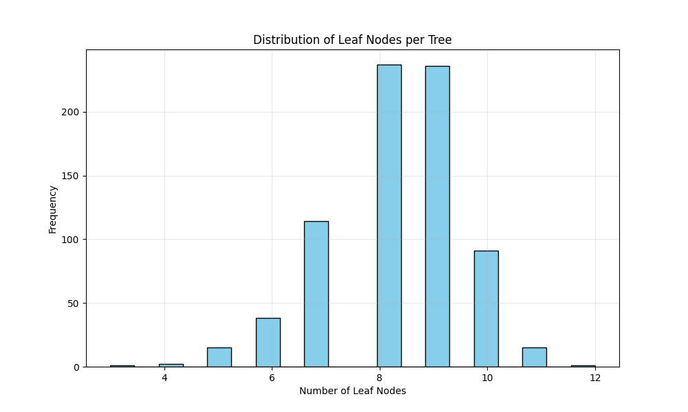
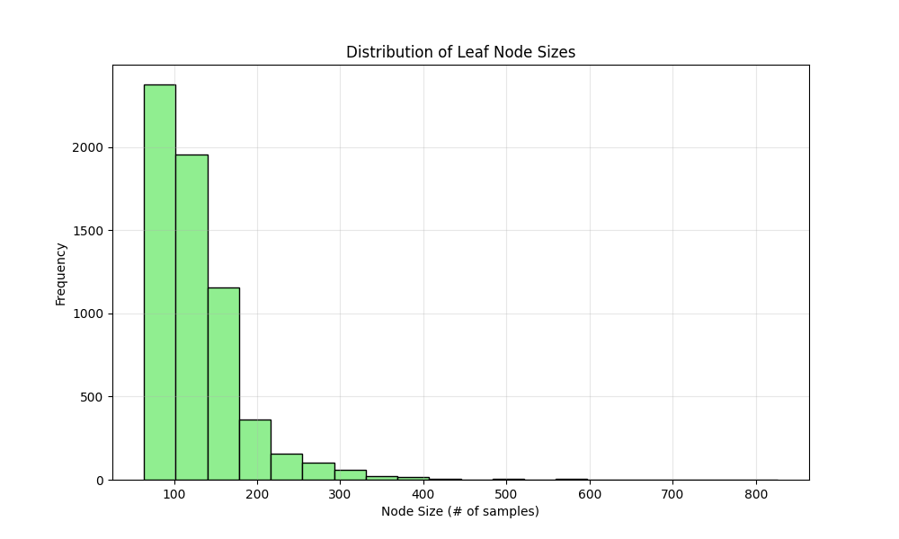
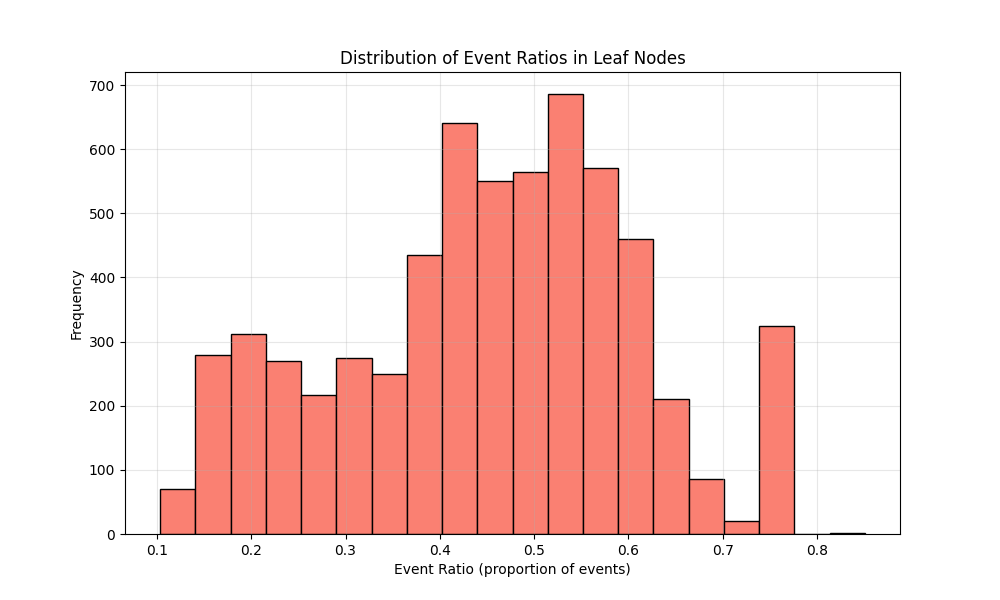

# RSF Model Specification:
Model file: rsf/rsf_results_affy/20250831_rsf_model-750-trees-maxdepth-10-19-features.pkl
Number of covariates: 19
Number of trees: 750
Max depth: 10
min_samples_leaf: 50
max_features: 0.3
min_weight_fraction_leaf: 0.0
Bootstrap: True
min_samples_split: 6
max_leaf_nodes: None
oob_score: False
warm_start: False
max_samples: None
Random state: 42
# Performance Metrics:
Training C-index (train + validation combined): 0.6953
Test C-index: 0.6904
Covariates 
- Adjuvant Chemo
- Age
- OS_STATUS
- IS_MALE
- OS_MONTHS
- Stage_IA
- Stage_IB
- Stage_II
- Stage_III
- Histology_Adenocarcinoma
- Histology_Adenosquamous Carcinoma
- Histology_Large Cell Carcinoma
- Histology_Squamous Cell Carcinoma
- Race_African American
- Race_Asian
- Race_Caucasian
- Race_Native Hawaiian or Other Pacific Islander
- Race_Unknown
- Smoked?_No
- Smoked?_Unknown
- Smoked?_Yes

 ## A Walk through the Forest:

### Tree Structure Statistics:
- **Number of trees**: 750
- **Leaf nodes per tree**: 8.29 ± 1.24 (mean ± std)
- **Range of leaf nodes**: 3 to 12
- **Average leaf node size**: 129.28 ± 53.99 samples
- **Range of node sizes**: 64 to 826 samples
- **Event ratio in leaf nodes**: 0.4514 ± 0.1570

### Visualizations:

### Key Findings:
- The forest consists of 750 trees with an average of 8.3 leaf nodes per tree
- Most leaf nodes contain between 94.0 and 149.0 samples (interquartile range)
- The event ratio distribution shows moderate homogeneity across leaf nodes
- Leaf nodes generally maintain balanced event/censoring proportions
    # Date: 20250831
# Time: 2025-08-31 21:41:17
