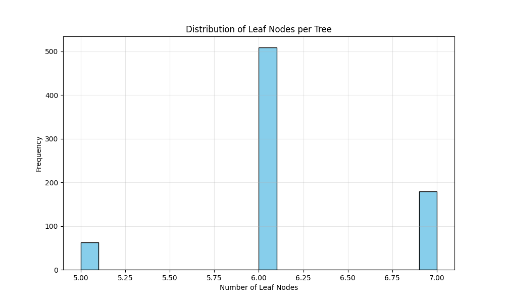
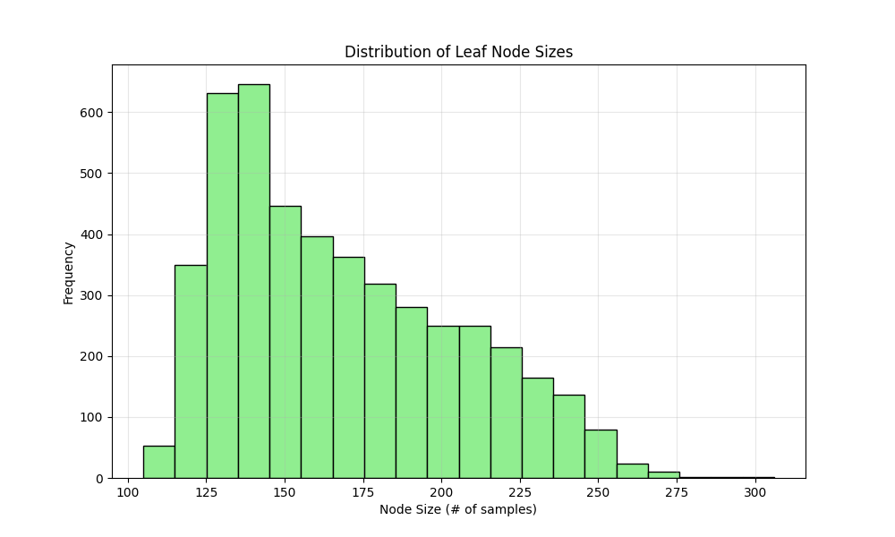
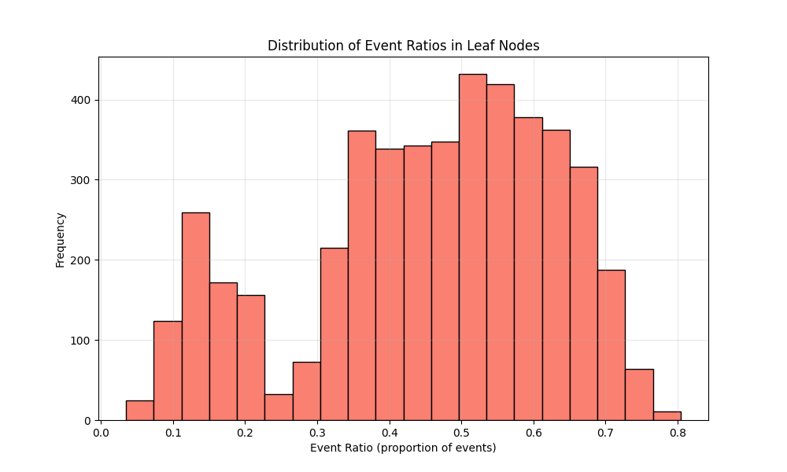

# RSF Model Specification:
Number of trees: 750
Max depth: 5
min_samples_leaf: 80
max_features: 0.2
min_weight_fraction_leaf: 0.0
Bootstrap: True
min_samples_split: 6
max_leaf_nodes: None
oob_score: False
warm_start: False
max_samples: None
Random state: 42
# Performance Metrics:
Training C-index (train + validation combined): 0.7769
Test C-index: 0.6206

 ## A Walk through the Forest:

### Tree Structure Statistics:
- **Number of trees**: 750
- **Leaf nodes per tree**: 6.16 ± 0.54 (mean ± std)
- **Range of leaf nodes**: 5 to 7
- **Average leaf node size**: 167.97 ± 36.79 samples
- **Range of node sizes**: 105 to 306 samples
- **Event ratio in leaf nodes**: 0.4544 ± 0.1740

### Visualizations:

### Key Findings:
- The forest consists of 750 trees with an average of 6.2 leaf nodes per tree
- Most leaf nodes contain between 137.0 and 195.0 samples (interquartile range)
- The event ratio distribution shows moderate homogeneity across leaf nodes
- Some leaf nodes are heavily skewed toward events or censoring
    # Date: 20260113
# Time: 2026-01-13 21:04:48
