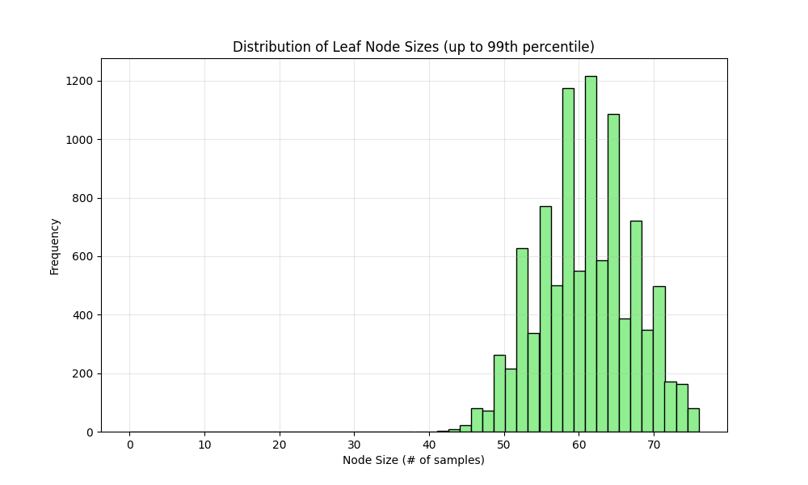
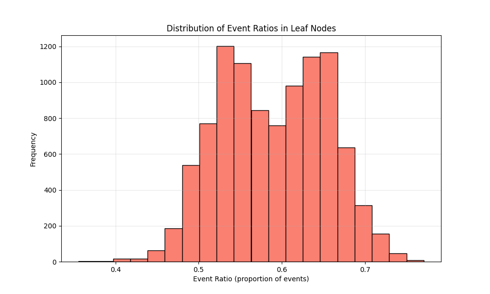

# RSF Model Specification:
Model file: 20250909_rsf_model-1000-trees-maxdepth-2-21286-features.pkl
Number of features: 21286
Number of trees: 1000
Max depth: 2
min_samples_leaf: 15
max_features: sqrt
Random state: 42

# Performance Metrics:
Training C-index: 0.9054
Test C-index: 0.6934

## A Walk through the Forest:

### Tree Structure Statistics:
- **Number of trees**: 1000
- **Leaf nodes per tree**: 3.24 ± 0.43 (mean ± std)
- **Range of leaf nodes**: 3 to 4
- **Average leaf node size**: 37.67 ± 14.22 samples
- **Range of node sizes**: 16 to 82 samples
- **Event ratio in leaf nodes**: 0.6158 ± 0.1651

### Visualizations:

### Key Findings:
- The forest consists of 1000 trees with an average of 3.2 leaf nodes per tree.
- Most leaf nodes contain between 27.0 and 46.0 samples (interquartile range).
- The event ratio distribution shows moderate homogeneity across leaf nodes.
- Some leaf nodes are heavily skewed toward events or censoring.
    
# Date: 20250909
# Time: 2025-09-09 20:52:24
