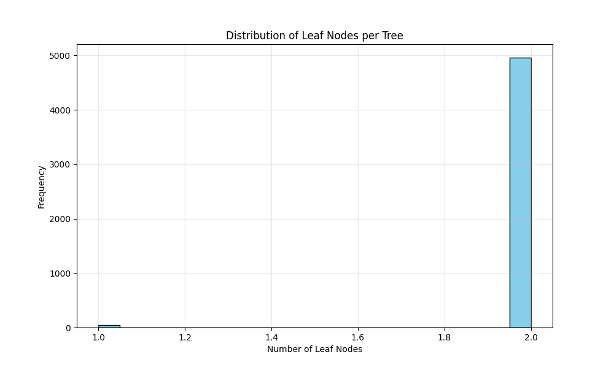
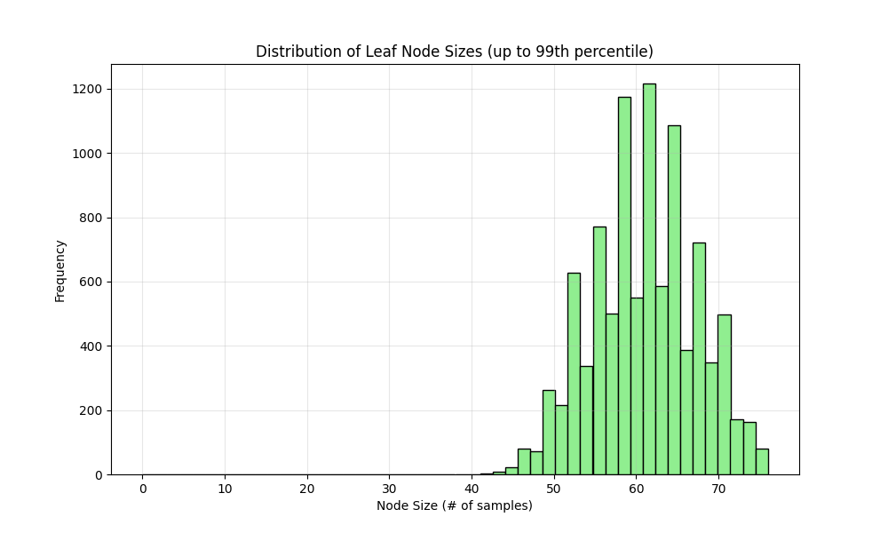
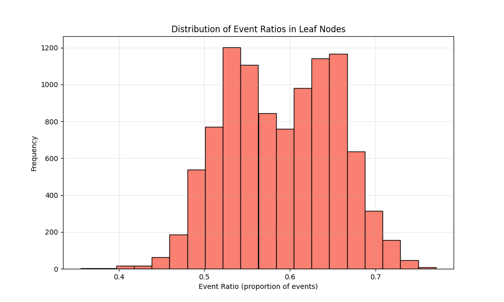

# RSF Model Specification:
Model file: 20250909_rsf_model-2000-trees-maxdepth-3-21286-features.pkl
Number of features: 21286
Number of trees: 2000
Max depth: 3
min_samples_leaf: 15
max_features: sqrt
Random state: 42

# Performance Metrics:
Training C-index: 0.9065
Test C-index: 0.7072

## A Walk through the Forest:

### Tree Structure Statistics:
- **Number of trees**: 2000
- **Leaf nodes per tree**: 3.97 ± 0.39 (mean ± std)
- **Range of leaf nodes**: 3 to 5
- **Average leaf node size**: 30.72 ± 7.75 samples
- **Range of node sizes**: 15 to 61 samples
- **Event ratio in leaf nodes**: 0.5981 ± 0.1817

### Visualizations:

### Key Findings:
- The forest consists of 2000 trees with an average of 4.0 leaf nodes per tree.
- Most leaf nodes contain between 25.0 and 36.0 samples (interquartile range).
- The event ratio distribution shows moderate homogeneity across leaf nodes.
- Some leaf nodes are heavily skewed toward events or censoring.
    
# Date: 20250909
# Time: 2025-09-09 20:52:35
