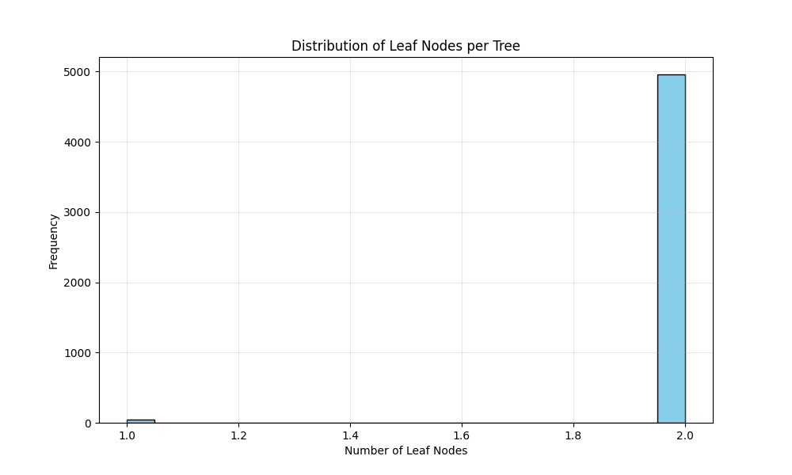

# RSF Model Specification:
Model file: 20250909_rsf_model-5000-trees-maxdepth-3-selected-genes.pkl
Number of features: 459
Number of trees: 5000
Max depth: 3
min_samples_leaf: 35
max_features: 0.01
Random state: 42

## Input Data:
- Training data: `train_merged.csv`
- Testing data: `test_merged.csv`
- Selected genes file: `cph/cox_prescreen_results/20250908_loocv_selected_genes_alpha_0.05.csv`

# Performance Metrics:
Training C-index: 0.8097
Test C-index: 0.7099

## A Walk through the Forest:

### Tree Structure Statistics:
- **Number of trees**: 5000
- **Leaf nodes per tree**: 1.99 ± 0.09 (mean ± std)
- **Range of leaf nodes**: 1 to 2
- **Average leaf node size**: 61.25 ± 7.38 samples
- **Range of node sizes**: 39 to 122 samples
- **Event ratio in leaf nodes**: 0.5904 ± 0.0645

### Visualizations:

### Key Findings:
- The forest consists of 5000 trees with an average of 2.0 leaf nodes per tree.
- Most leaf nodes contain between 57.0 and 65.0 samples (interquartile range).
- The event ratio distribution shows moderate homogeneity across leaf nodes.
- Leaf nodes generally maintain balanced event/censoring proportions.
    
# Date: 20250909
# Time: 2025-09-09 21:08:15
